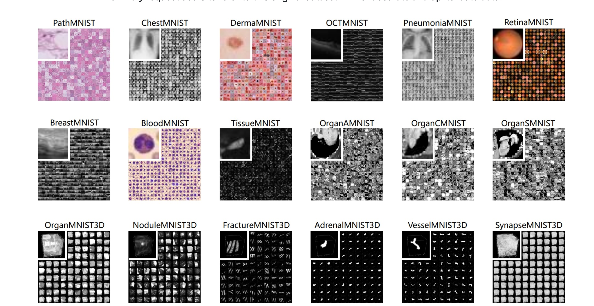

# Medmnist stuff

- We'd want something like eye's retina medmnist
- Multiple Size Options: 28 (MNIST-Like), 64, 128, and 224
- Biomedical Classification
- 

## Notes
- We have the paper of Medmnist: https://www.nature.com/articles/s41597-022-01721-8
- We have a frontend, backend, out new med dataset.

